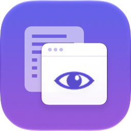

<p align="center">

</p>

<h1 align="center">PeekPreview</h1>

Preview links in an overlay with **Shift+Click** in Safari, without leaving the page — inspired by Arc's Peek.

Requires **Safari 27** or later (macOS 15 Sequoia or later).

## Features

- Shift+Click (or Shift+middle-click) any link to open it in an overlay.
- Refresh, copy link, and Auto / Light / Dark theme in the header.
- Open in a new tab or close (Esc, or click outside) from the side buttons.
- Drag the window by its header; resize from any edge or corner.
- Sites that forbid embedding (GitHub, many news and login-protected sites) open in a peek-sized
  popup window instead; close it with ⌘W.

## Build and run

1. Optional: copy `Config/Local.xcconfig.example` to `Config/Local.xcconfig` and set your
   `DEVELOPMENT_TEAM`.
2. In Safari: **Settings → Advanced → Show features for web developers**, then
   **Develop → Developer Settings… → Allow unsigned extensions** (only needed for unsigned local
   builds).
3. Open `PeekPreview/PeekPreview.xcodeproj` in Xcode 26.3 or later and run the **PeekPreview**
   scheme.
4. **Safari Settings → Extensions**: turn on PeekPreview and allow it on **All Websites**.

## Development

| Path | What |
| --- | --- |
| `Extension/` | Web extension source (manifest, background, content script, overlay frame) |
| `Extension/lib/peek-core.js` | Pure logic shared by the scripts, unit tested |
| `PeekPreview/` | Xcode project: container app + Safari extension target |
| `PeekPreview/PeekPreview/AppIcon.icon` | App icon — open in Icon Composer |
| `Config/Shared.xcconfig` | Bundle ID prefix, team, deployment target, version |

```sh
node --test tests/*.test.js      # unit tests
for t in scripts/*.test.sh; do "$t"; done   # release script tests
xcrun swift-format lint -s -p -r PeekPreview/   # Swift lint (CI runs this)
scripts/export-icons.sh          # after editing AppIcon.icon: re-export the extension PNGs
xcodebuild -project PeekPreview/PeekPreview.xcodeproj -scheme PeekPreview build
```

## Releasing

CI (`.github/workflows/ci.yml`) lints, tests, and builds every push to `main` and every pull request.

To ship a version to the App Store:

1. Write the release notes in `release-notes/next.md` (start from `release-notes/TEMPLATE.md`) and
   merge to `main`.
2. Actions → **🚀 Release** → choose patch / minor / major. Run it once with **dry run** checked
   first: it archives, signs, and exports the `.pkg` without uploading anything.
3. The workflow bumps the version (`Config/Shared.xcconfig` and `Extension/manifest.json`),
   uploads the build to App Store Connect, tags `vX.Y.Z`, creates a GitHub release with the notes,
   and commits the new version back to `main`.
4. In App Store Connect, add the "What's New" text and submit the build for review.

One-time setup: repository secrets `AC_API_KEY_P8_BASE64`, `AC_API_KEY_ID`, `AC_API_ISSUER_ID`
(an App Store Connect API key with the Admin role, used for cloud-managed signing), and an app
record for `dev.joshuapark.PeekPreview` in App Store Connect. Details are at the top of
`.github/workflows/release.yml`.

## Notes

- Shift+Click normally adds a link to Safari's Reading List; PeekPreview replaces that on links
  it previews.
- Safari doesn't apply `declarativeNetRequest` rules that remove response headers such as
  `X-Frame-Options` (tested on Safari 27), so blocked sites can't be forced into the overlay.
- Some sites detect being framed with JavaScript or block cookies in third-party frames, so they
  may not work fully in the overlay — use **Open in new tab**.

## License

GPL-3.0 — see [LICENSE](LICENSE). Portions derived from BerryPeek are MIT-licensed — see
[THIRD_PARTY_NOTICES.md](THIRD_PARTY_NOTICES.md). Privacy: [PRIVACY.md](PRIVACY.md).
